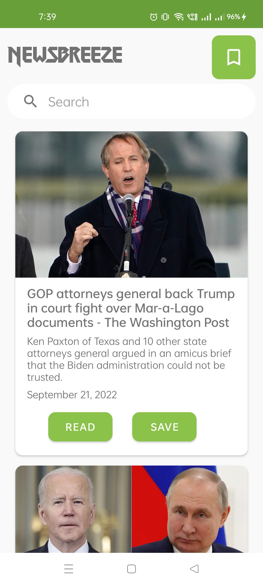
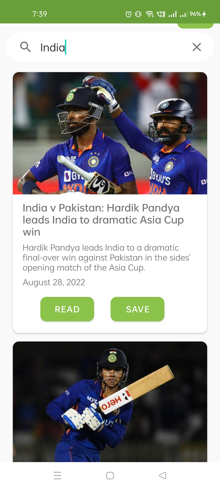
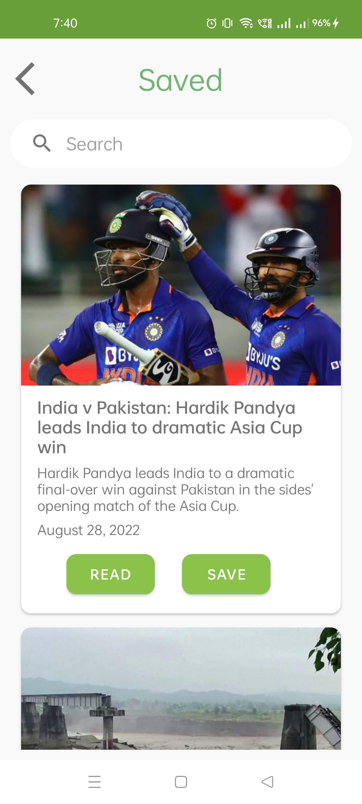
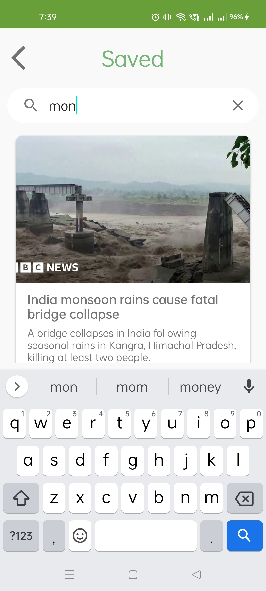
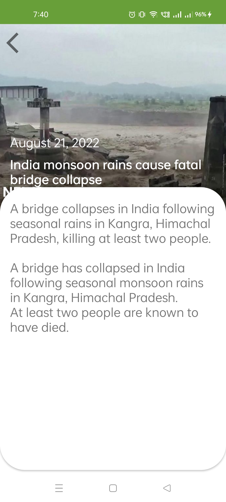

# NewsBreeze

## Synopsis

NewsBreeze is an unofficial newsApi client that gets the latest breaking news to you.

## Table of Contents

> * [Title](#beat-box)
> * [Synopsis](#synopsis)
> * [Table of Contents](#table-of-contents)
> * [Features](#features)
> * [Permission](#permission)
> * [Libraries Used](#libraries-used)
> * [Installation Guide](#installation-guide)
> * [Preview](#preview)
> * [Resources](#resources)

## Features

* **Search** lets you find any news by simply typing in a keyword in the search box. Easy access to your favorite topics of intrest via the search option.
* **Bookmark** your articles and save them locally to read later.
* **MVVM** with Android Architecture Components(Room, LiveData, ViewModel)

## Permission

This app requires *Internet permission* to access data from the newsapi.org

## Libraries Used

- [Retrofit](http://square.github.io/retrofit/) For sending network requests and parsing JSON data.
- [Picasso](https://square.github.io/picasso/) Loading and caching images.
- [Room](https://developer.android.com/jetpack/androidx/releases/room?gclid=Cj0KCQjw7KqZBhCBARIsAI-fTKJygUHRpWjxKnKZ4bx-jRwy6rAsorbNIqBtrxgIJ_iN8wV5bl_Wk1gaAqwLEALw_wcB&gclsrc=aw.ds) is a database layer on top of an SQLite database.
- [Livedata](https://developer.android.com/topic/libraries/architecture/livedata) for easier implementation of MVVM architecture.
- [Gson](https://github.com/google/gson) to convert json string to their respective kotlin objects

## Installation Guide

Clone the repository and import into Android Studio

```bash
https://github.com/AKSingh18/NewsBreeze.git
```

For a quick installation download the [apk](apk/app-debug.apk)

## Preview

A quick [demo](files/demo.mp4) video has also been added for preview. 

  
  
  

## Resources

* [NewsBreeze by Dhanesh](https://github.com/dhaneshchappidi/NewsBreeze))
* [Android Developers](https://developer.android.com/)
